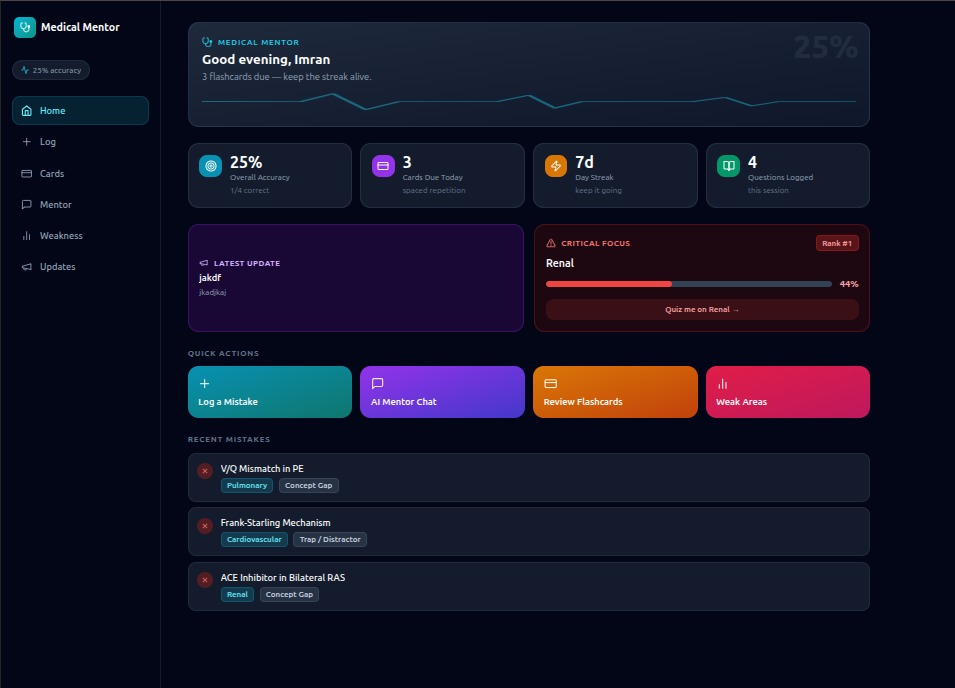
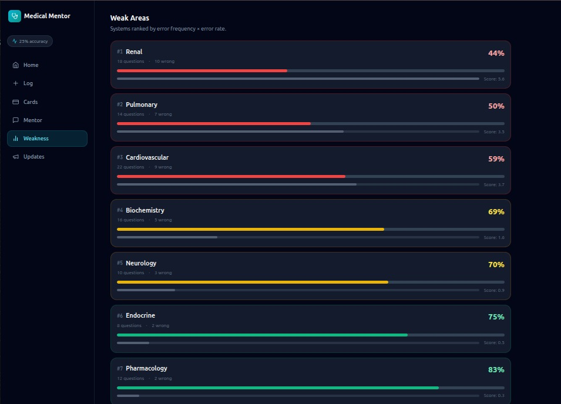
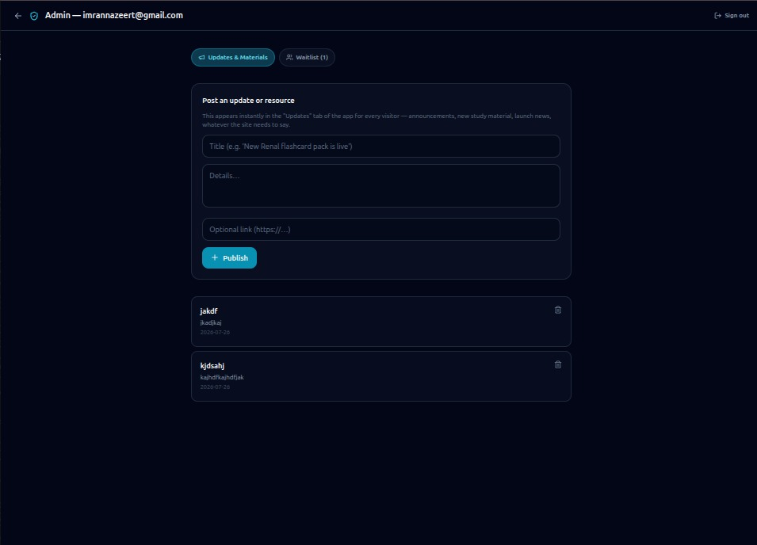

<div align="center">

# 🩺 Medical Mentor

**Turn every wrong practice question into a board-exam win.**

Mistake tracking, weak-area analytics, and spaced-repetition flashcards — built for medical students preparing for UWorld, NBME, and board exams.

[Live Demo](https://farhanalikalyani.github.io/medical-mentor/) · [Report an Issue](../../issues) · [Request a Feature](../../issues)

</div>

---

## Overview

Most students study the same way and get the same result: they re-read mistakes without fixing the underlying gap, and don't actually know which subject is failing them. Medical Mentor replaces that guesswork with a structured system:

- **Log every mistake** with the concept it tested, why you missed it, and a takeaway in your own words
- **See your weak areas ranked automatically** by a weighted score (error count × error rate) — not a feeling
- **Review flashcards on a real spaced-repetition schedule** (SM-2 algorithm), so time goes to what you're actually forgetting
- **Get AI-mentor guidance** — targeted quiz vignettes, study plans, and mistake-pattern breakdowns

This repo is also set up as a **learning project** — see the [Practice Roadmap](#-practice-roadmap) below if you want to use it to sharpen your own React/Firebase skills.

---

## Screenshots

| | |
|---|---|
|  |  |
|  | |

---

## Features

| Area | What it does |
|---|---|
| 📊 **Live app** | Mistake log, weak-area analytics, flashcards, AI mentor chat |
| 🔐 **Admin panel** | Restricted to one approved account; posts updates that appear on the site instantly |
| 📇 **Spaced repetition** | Real SM-2 algorithm (ease factor, interval, repetition count) |
| 📈 **Weakness scoring** | `score = incorrect × (1 − accuracy)`, ranked live |
| 🖥️ **Responsive** | Sidebar dashboard on desktop, native app-style bottom nav on mobile |

---

## Tech stack

- **[React 18](https://react.dev/)** + **[Vite](https://vitejs.dev/)** — UI and build tooling
- **[Tailwind CSS](https://tailwindcss.com/)** — styling
- **[Firebase](https://firebase.google.com/)** (Firestore + Authentication) — live updates, admin login, waitlist storage
- **[Lucide](https://lucide.dev/)** — icons
- **GitHub Actions + GitHub Pages** — CI/CD and free static hosting

---

## Getting started

### Prerequisites
- [Node.js](https://nodejs.org/) 18+
- A free [Firebase](https://console.firebase.google.com/) project

### Local development

```bash
git clone https://github.com/farhanalikalyani/medical-mentor.git
cd medical-mentor
npm install
npm run dev
```

The app runs immediately with demo content. Admin login and live updates need Firebase — see [`src/firebase.js`](./src/firebase.js) and the setup steps in [Firebase & Deployment Setup](#firebase--deployment-setup) below.

### Build for production

```bash
npm run build
```

---

## 🧭 Practice Roadmap

This project is deliberately structured so someone learning React, Firebase, or full-stack deployment can use it as a hands-on course. Work through these roughly in order — each builds on skills from the last.

### 🟢 Level 1 — Get it running (Environment & Git)
- [ ] Clone the repo and get `npm run dev` working locally
- [ ] Make a small visible change (e.g. change the accent color from cyan to another Tailwind color) and see it hot-reload
- [ ] Create your **own** Firebase project from scratch, following the setup steps below, and connect it to your local copy
- [ ] Push your own fork to GitHub and get it live on your own GitHub Pages URL

**Skills practiced:** git, npm, Vite dev server, Firebase project setup, GitHub Pages deployment.

### 🟡 Level 2 — Understand the data flow
- [ ] Read `src/mockData.js` and trace exactly how one mistake entry flows from `LogMistakeScreen` → `handleLogSubmit` → `updateWeakAreas` → the Weak Areas screen
- [ ] Add a new field to the mistake log form (e.g. "time spent on question in seconds") and display it in the Question Log screen
- [ ] Implement a **second weakness metric** — e.g. rank by raw error count only, and let the user toggle between the two ranking methods

**Skills practiced:** React state management, prop drilling, derived state, array/object transforms.

### 🟠 Level 3 — Make the data persistent
Right now, mistakes/flashcards/weak areas reset on every page refresh — only Updates & Waitlist are saved in Firestore. This is the single biggest real upgrade you can make:
- [ ] Design a Firestore schema for `mistakes` and `flashcards` collections
- [ ] Add simple student sign-in (email/password, same pattern as the admin login) so each student's data is private to them
- [ ] Migrate `questionLog`, `flashcards`, and `weakAreas` state from local `useState` to Firestore, using `onSnapshot` for live sync
- [ ] Update `firestore.rules` so a student can only read/write their own documents (hint: store a `userId` field on each document and check `request.auth.uid == resource.data.userId`)

**Skills practiced:** Firestore data modeling, Firebase Auth for regular users (not just admin), security rules with per-user scoping.

### 🔴 Level 4 — Replace the mocked AI with a real one
- [ ] Read how `getMockResponse()` in `mockData.js` keyword-matches messages
- [ ] Wire the chat screen to a real LLM API call instead (Anthropic API, OpenAI, or similar) — this requires a backend proxy (Firebase Cloud Function) so your API key isn't exposed in the browser
- [ ] Feed the student's actual weak areas and recent mistakes into the prompt, so the AI mentor gives genuinely personalized quizzes instead of scripted ones

**Skills practiced:** Firebase Cloud Functions, prompt engineering, API key security, connecting a serverless backend to a static frontend.

### ⚫ Level 5 — Production hardening
- [ ] Add loading skeletons instead of blank states while Firestore data loads
- [ ] Add error boundaries so one broken screen doesn't crash the whole app
- [ ] Split the JS bundle with dynamic `import()` (the build currently warns about a 650KB+ bundle — code-splitting per screen would fix this)
- [ ] Add automated tests (Vitest + React Testing Library) for the SM-2 flashcard scheduling logic and the weakness-score calculation, since these are the two places a silent bug would be worst
- [ ] Set up a staging environment (a second Firebase project) so you can test changes before they hit the real admin/waitlist data

**Skills practiced:** performance optimization, testing, error handling, environment separation — the difference between "working" and "production-ready."

---

## 🚀 Improvement Roadmap (feature ideas)

Beyond the practice exercises above, here's the actual product roadmap — ideas for where this project goes next, roughly ordered by impact:

- [ ] **Real AI mentor** (see Level 4 above) — the single highest-impact upgrade
- [ ] **Per-student accounts** so progress isn't lost on refresh (see Level 3)
- [ ] **Native mobile app** (React Native/Expo) once the web version has proven demand via the waitlist
- [ ] **Import questions in bulk** (CSV upload) instead of logging one mistake at a time
- [ ] **Study groups / leaderboards** — friendly competition between classmates
- [ ] **Push notifications** for due flashcards (would need a service worker + Firebase Cloud Messaging)
- [ ] **Dark/light theme toggle** — currently dark-only
- [ ] **Export progress as PDF** — shareable study report

---

## Firebase & Deployment Setup

1. **Firestore Database** → create in test mode → set region close to your users
2. **Authentication** → enable Email/Password → add your admin account under Users
3. **Project settings → Your apps** → register a web app → copy the config into `src/firebase.js`
4. **Firestore → Rules** → paste in [`firestore.rules`](./firestore.rules) → Publish
5. Push to GitHub → **Settings → Pages → Source: GitHub Actions** → deploys automatically via [`.github/workflows/deploy.yml`](./.github/workflows/deploy.yml)

If you rename the repo, update `base` in [`vite.config.js`](./vite.config.js) to match.

---

## Project structure
```text
medical-mentor/
├── src/
│   ├── App.jsx                     # Hash-based routing: app / admin
│   ├── firebase.js                 # Firebase config + admin email gate
│   ├── mockData.js                 # Demo content (start here to understand data shape)
│   └── components/
│       ├── MedicalMentorApp.jsx    # Full product (mistake log, flashcards, etc.)
│       └── AdminPanel.jsx          # Gated admin login + content management
├── firestore.rules                # Firestore security rules
└── .github/
    └── workflows/
        └── deploy.yml             # GitHub Actions deployment workflow
```
---

## Security notes

- The Firebase web config in `src/firebase.js` is safe to be public — Firebase API keys identify a project, they don't authorize access on their own
- The real access control lives in [`firestore.rules`](./firestore.rules) — always treat this file, not the login screen, as the actual security boundary

---

## Contributing

If you work through the Practice Roadmap and build something you're proud of, open a pull request — even partial progress on a Level 3+ item is a great portfolio addition to reference.

---

## License

This project is currently private/unlicensed pending launch. All rights reserved.

<div align="center">

Built for medical students, by medical students. 🇵🇰

</div>
